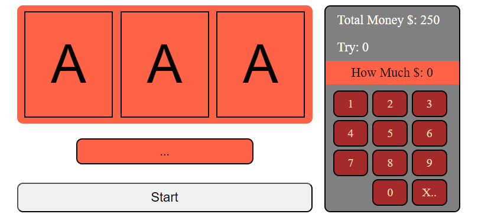

# Gamble Game by Samiran

🎲 Welcome to the Gamble Game project by Samiran! Test your luck and see if you can beat the house in this simple and exciting gambling game. 💸

## Table of Contents

- [Introduction](#introduction)
- [How to Play](#how-to-play)
- [Features](#features)
- [Demo](#demo)
- [Contribution](#contribution)
- [License](#license)

## Introduction

Gamble Game is a web-based game created using pure HTML, CSS, and JavaScript. The objective is straightforward: beat the house by spinning the wheel and matching three characters to win big! The game provides a thrilling experience with fake money—no real risks involved.

## How to Play

1. Visit the game site: [Gamble Game](https://samiran845.github.io/Gamble_Game/).
2. Start with the fake money provided.
3. Click the "Spin" button to turn the wheel.
4. Match three characters to win!
5. Keep playing to test your luck and see how much fake money you can accumulate.

## Features

- 🎰 Spin the wheel for a chance to win big.
- 💸 Fake money system for risk-free gambling fun.
- 🔄 Play multiple rounds to test your luck.
- 📈 Track your winnings and aim for the top score.

## Demo

Check out the live demo of the Gamble Game [here](https://samiran845.github.io/Gamble_Game/).

## Contribution

Contributions are welcome! If you have ideas for improvement, new features, or bug fixes, feel free to open an issue or submit a pull request. Let's make the Gamble Game even more thrilling together.

## License

Feel free to play, modify, and share the game with others.

---

Take a chance and enjoy the excitement of the Gamble Game by Samiran! 🎲💰